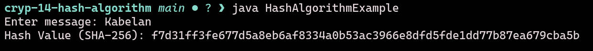

# EX-NO14-HASH-ALGORITHM

## AIM

To implement HASH ALGORITHM

## ALGORITHM

1. Hash Algorithm is used to convert input data (message) into a fixed-size string, typically a hash value, which uniquely represents the original data.

2. Initialization:
   - Choose a hash function \( H \) (e.g., SHA-256, MD5, etc.).
   - The message \( M \) to be hashed is input.

3. Message Preprocessing:
   - Break the message \( M \) into fixed-size blocks. If necessary, pad the message to make it compatible with the block size required by the hash function.
   - For example, in SHA-256, the message is padded to ensure that its length is a multiple of 512 bits.

4. Hash Calculation:
   - Process the message block by block, applying the hash function \( H \) iteratively to produce an intermediate hash value.
   - For SHA-256, each block is processed through a series of logical operations, bitwise manipulations, and modular additions.

5. Output:
   - After all blocks are processed, the final hash value (digest) is produced, which is a fixed-size output (e.g., 256-bit for SHA-256).
   - The resulting hash is unique to the input message, meaning even a small change in the message will result in a completely different hash.

6. Security: The strength of the hash algorithm lies in its collision resistance, ensuring that it is computationally infeasible to find two different messages that produce the same hash value.

## Program

```java
import java.security.MessageDigest;
import java.security.NoSuchAlgorithmException;
import java.util.Scanner;

public class HashAlgorithmExample {

    // Method to generate SHA-256 hash
    public static String generateHash(String input) {
        try {
            // Step 1: Choose Hash Algorithm
            MessageDigest md = MessageDigest.getInstance("SHA-256");

            // Step 2: Convert input string to byte array
            byte[] hashBytes = md.digest(input.getBytes());

            // Step 3: Convert byte array into hexadecimal format
            StringBuilder hexString = new StringBuilder();

            for (byte b : hashBytes) {
                String hex = Integer.toHexString(0xff & b);
                if (hex.length() == 1) {
                    hexString.append('0');
                }
                hexString.append(hex);
            }

            return hexString.toString();

        } catch (NoSuchAlgorithmException e) {
            throw new RuntimeException("Error: Algorithm not found", e);
        }
    }

    public static void main(String[] args) {
        Scanner scanner = new Scanner(System.in);

        // Input message
        System.out.print("Enter message: ");
        String message = scanner.nextLine();

        // Generate hash
        String hashValue = generateHash(message);

        // Output result
        System.out.println("Hash Value (SHA-256): " + hashValue);

        scanner.close();
    }
}
```

## Output



## Result

The program is executed successfully.
